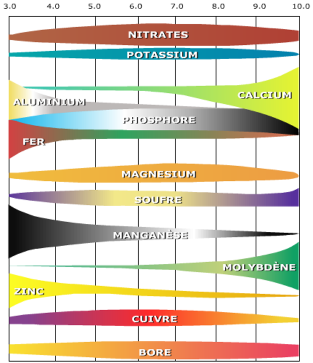
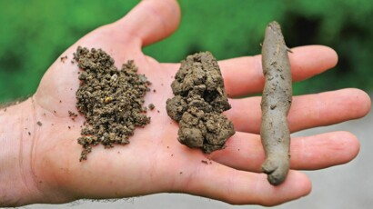
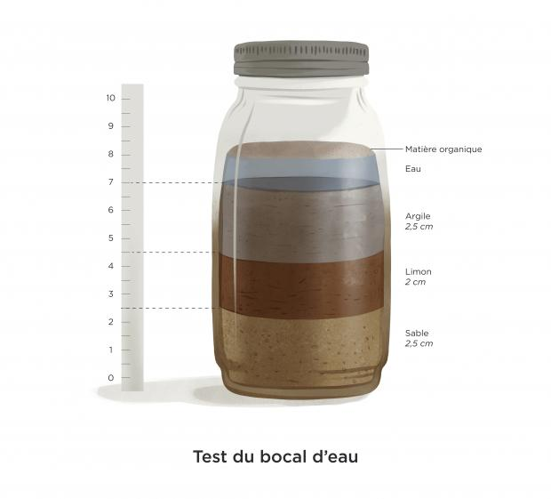
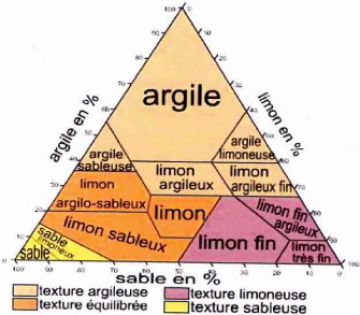

Analyse du sol
==============

Formation d'un sol
------------------

Le sol se forme par l'érosion des roches. L'érosion se produit par le vent, le soleil, l'eau, les mousses, les champignons, les lichens et les bactéries.

Le sol met du temps à se former. Plus un sol est profond, plus il est vieux. Plus un sol possède de strates différentes, plus il est vieux. 

.. important:: 
  Les racines les plus grandes des plantes potagères vont en moyenne à **40cm** de profondeur. 
  
  C'est donc cette partie du sol la plus intéressante à analyser pour la culture nourricière (hors arbres).

La roche mère va influencer la création du sol, notamment le PH du sol :

  - Les sols graniteux et schisteux sont **acides**
  - Les sols calcaires sont **basiques**

Il est possible de diminuer l'acidité du sol, en le **chaulant** (apport de calcaire à la terre, sous forme de chaux ou autre).

En fonction du PH du sol, les nutriments du sol seront plus ou moins disponibles :

.. warning:: 
 Le sol est un milieu menacé et précieux :
    - l'érosion des sols peut être limité par la **plantation d'haies sur talus** par exemple (afin de limiter la perte de sol lors des grosses pluies) 
    - la vie du sol peut être favorisée par la **couverture des sols** (paillage, couverts végétaux, bâches, compost) et **le non-travail du sol**
  
  Il est facile de perdre du sol, pratiquement impossible d'en gagner. 

Composition globale d'un sol
----------------------------

Au niveau atomique, un sol est composé en moyenne de :

- 45% d'Oxygène
- 45% de Carbone
- 6% d'Hydrogène
- 1,5% d'Azote
- 1% de Potassium
- 0,5% de Calcium
- 0,2% de Phosphore
- 0,2% de Magnésium
- + Souffre, Manganèse, Zinc, Bore, Cuivre,...

Compléter avec les nutriments du sol (molécules et ions)

Le sol est donc composé d'une phase solide (détaillée ci-dessous),liquide (eau) et gazeuse (oxygène).

Phase solide (en prairie) :
- 95% de minéraux
- 5% de constituants organiques :

            - 85% de matières organiques en déComposition
            - 10% de racines
            - 5% d'organismes vivants

Sols argileux, limoneux ou sableux ?
------------------------------------

Granulométrie des minéraux 
~~~~~~~~~~~~~~~~~~~~~~~~~~

En fonction de la taille des minéraux :

- De 2mm à 0,05mm on qualifie les minéraux de **sable**
- De 0,05mm à 0,02mm on qualifie les minéraux de **limon**
- Pour les grains en dessous de 0,002mm, on qualifie les minéraux d'**argile**

    
  *Terre sableuse, limoneuse et argileuse*

Le sable
~~~~~~~~

Les sols sableux sont **pauvres en nutriments et très drainants** (l'eau et les nutriments s'écoulent vite dans les profondeurs).

Pour avoir une idée du taux de sable dans une terre :

- Si les grains sont visibles à l'oeil nu, il y a **au moins 50% de sable** dans l'échantillon
- Si aucune rugosité n'est ressentie en frottant un peu de terre, il y a **moins de 15% de sable** dans l'échantillon

Le limon
~~~~~~~~

Les sols limoneux ont un **toucher doux et soyeux**, similaire à du **talc**. Ils sont souvent **riches en fer**, donc de couleur ocre. Ce type de sol est sensible aux **tassements et aux croûtes de battance**.

.. important::
  La battance est une croûte qui se forme en surface du sol par l'action des gouttes de pluie (et accentuée par les engins agricoles). 
  
    .. image:: ../_static/images/battance.jpeg
       :width: 300

  Le sol en surface n'est alors plus poreux, les interstices étant comblés par des agrégats de matière sèche. 
  
  Ce phénomène pose un problème pour la germination et la levée des semis notamment.
  
L'argile
~~~~~~~~

Les sols argileux ont un **toucher collant** et sont des sols **lourds**. Ces sols **retiennent l'eau** (à tendance hydromorphe) et sont souvent **riches en nutriments**. 

Le complexe argilo-humique est chargé négativement et attire donc les ions positifs présents dans la terre (mettre exemple)

Pour avoir une idée du taux d'argile dans une terre :

- S'il est possible de former un boudin qui se tient avec la terre, il y a entre **17 et 20% d'argile** dans l'échantillon
- S'il est possible de faire un anneau avec ce boudin, il y a plus de **30% d'argile** dans l'échantillon

Caractériser un sol
-------------------

Dans les faits, un sol n'est pas 100% argileux, sableux ou limoneux. C'est un mélange de minéraux de tailles différentes en proportions variables. 

Pour avoir une idée de ces proportions il est possible de faire le **test du bocal** :

- Mettre 1/3 de terre dans un bocal et 2/3 d'eau
- Secouer pendant quelques minutes
- Laisser reposer le bocal 24h sans le déplacer, pour laisser à l'argile le temps de se déposer

Différentes strates vont apparaitre, avec les sables au fond, les argiles en haut et les limons en couche intermédiaire.

 
Pour caractériser la granulométrie d'un sol, on utilise le **triangle des textures** :

.. important::
  Pour avoir une idée précise de la composition de son sol, le mieux est de faire une analyse de sol par un laboratoire accrédité par le ministère de l'agriculture (`liste <https://agriculture.gouv.fr/laboratoires-officiels-et-reconnus-en-sante-des-vegetaux>`_). 

  Une analyse de sol coûte entre 50 et 200€ en fonction de la méthode employée. 

  Une analyse de sol donnera la granulométrie du sol mais également d'autre informations précieuses :

  - Nutriments diponibles dans le sol (NPK -Azote, Phosphore, Potassium- en particulier)
  - PH du sol
  - Structure du sol (semelle de labour,croûte de battance, tassements, etc)
  - Capacité de rentention de l'eau du sol
  - Analyse des éléments traces métalliques *(pas systématique mais pertinent pour évaluer la pollution de son sol aux métaux lourds)*
  
.. attention:: 
  Ne pas faire un profil de sol :

  - en plein été ou en plein hiver
  - après une fertilisation importante du sol
  - après un chaulage du sol
  
  sous risque d'avoir une analyse de sol non représentative.  

Les êtres vivants du sol
------------------------

Le sol est un milieu vivant et **cette vie est indispensable au sol** (décomposition des matières organiques, aération de la terre, minéralisation du sol, apport d'azote et de carbone etc.).

Dans ces êtres vivants il y a des animaux (:ref:`focus sur les annélides<les vers de terre (annélides)>`), des protozoaires, des champignons, des bactéries et des végétaux. Certains de ces êtres vivants ont besoin d'air pour vivre et respirer, d'autre non (d'où l'importance d'avoir un sol aéré).

Les plantes présentes sur un sol peuvent d'ailleurs donner des indications sur l'état du sol : :ref:`plantes bio-indicatrices <plantes bio-indicatrices>`