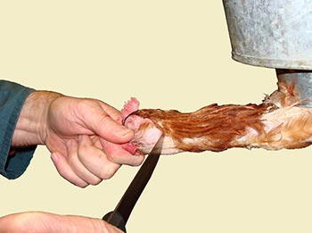
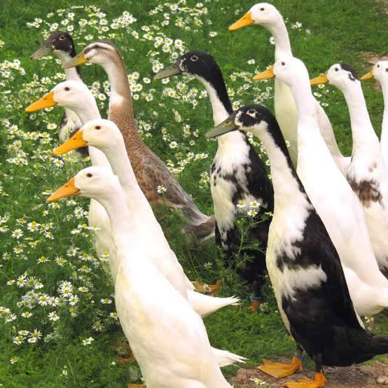

Animaux
=======

Abeilles
--------

- Faciliter la pollenisation
- Faire du miel pour avoir une source de sucre, et pourquoi pas en vendre

Poules
------

Les oeufs sont une importante source de protéine, et permettent d'étendre drastiquement le champs des possibles en matière de cuisine.

De plus, les poules sont des alliées idéales en matière de compost, elles peuvent aider à transformer le compost en humus plus rapidement, en retournant celui-ci avec leurs griffes.

La `poule noire de Janzé <https://youtu.be/viSl4Gv9mqU?t=348>`_ est réputée pour manger les frelons (encore faut-il qu'elle soit eduquée pour) et ainsi protéger les abeilles (mettre le poulailler proche de ruches).

Si une poule ne pond plus ou est en fin de vie, celle-ci peut bien entendu finir dans votre assiette.
À noter que même si vous n'avez pas l'intention de manger la viande de vos poules, savoir les tuer le plus humainement
possible reste une corde qu'il est préférable d'avoir à son arc. 
Ne serait-ce que si l'animal est malade et souffre, plutôt que de l'emmener à l'abattoir pour qu'il se fasse exécuter dans des conditions non maitrisées
(ou chez le vétérinaire $$$ pour le faire euthanasier),
vous avez la possibilité directement sur place et dans les meilleures conditions, d'exécuter vos poules.

Pour tuer un poulet:

- Le faire le matin ou le soir quand la luminosité est réduite (ils sont plus détendus)
- Isoler le poulet pendant 12 heures sans le nourrir, afin de vider son estomac (très important pour l'hygiène)
- Dislocation du cou, ça semble être la méthode recommandée pour tuer l'animal sans matériel et le plus humainement possible, il s'agit cependant d'une technique pas évidente quand on est pas entrainé. La HSA recommande de s'entrainer sur un poulet déjà mort si possible. Le faire manuellement plutôt qu'avec des outils semble également être préférable, car les outils ont tendance à serrer le cou de l'animal et l'asphyxier (ce qui entraine de la souffrance, chose que nous voulons bien évidemment éviter).
- Saigner le poulet le plus rapidement possible, les deux artères doivent être coupées avec un couteau très affuté et propre.

Guide très détaillé sur l'abattage de poulets: `Practical Slaughter of Poultry <https://www.hsa.org.uk/introduction-1/introduction-3>`_

Canards coureurs indiens
------------------------

Mangent les limaces, les escargots et les larves de moustiques.

