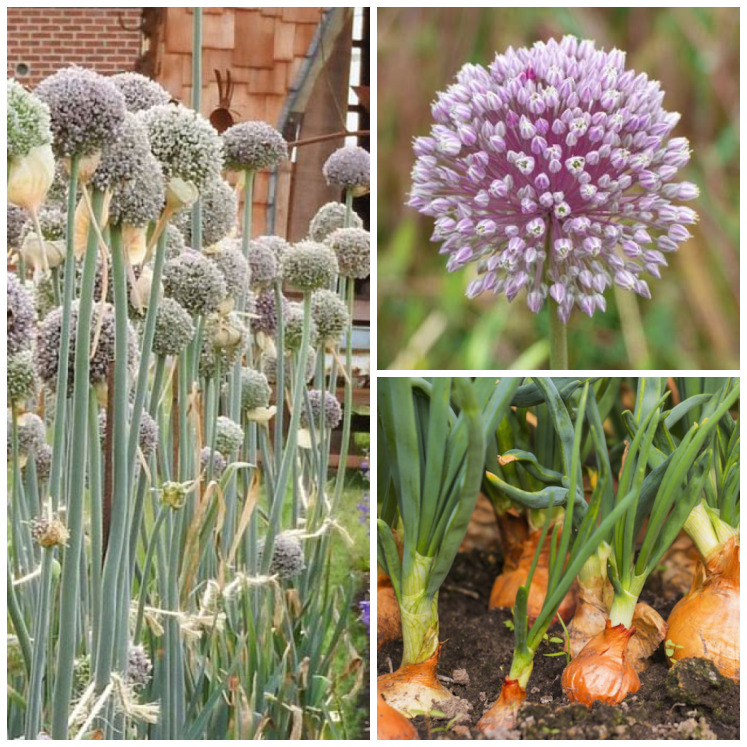

Reconnaitre les familles de plantes
======================================

.. important:: 
    
    Pourquoi connaitre les familles de plantes cultivées ? 
    
    Faire une **rotation** des familles de plantes en culture permet :
        - de diversifier les nutriments piochés par les plantes et les apports au sol
        - d'éviter qu'un ravageur devienne prédominant

Les poacées (*les graminées*)
#################################
*Blé, orge, seigle, bambou, avoine, canne à sucre, riz, millet, sorgho,...*

Feuilles allongées à nervures parrallèles et fleurs en épillet

Les fabacées (*les légumineuses*)
###################################

*Lentille, fève, haricot, pois, pois chiche, arachide, luzerne, trèfle, soja, glycine,...*

.. important::  

    Les fabacées sont la seule famille capable de transformer l'azote de l'air en **azote** du sol, grâce à une symbiose avec des bactéries. C'est donc un **engrais vert** très intéressant.

    
Fleurs avec 5 pétales inégales et graines dans des gousses 

.. important::
    
    Les fabacées sont très riches en **protéines**, ce qui en font un aliment très intéressant pour les animaux (et les humains), notamment pour la production de lait.

Les brassicacées
###################

*Choux, colza, moutarde, roquette, navet, radis, cresson,...*

**Odeur souffrée** caractéristique et fleurs à **4 pétales** disposées en forme de croix

Les rosacées
#################

*Rose, cerise, pomme, pêche, framboise, fraise, abricot, cassis, myrtilles, ronces,...*

Feuilles souvent dentées et fleurs avec **5 pétales séparées**

Les astéracées
################

*Artichaut, tournesol, salade, endive, estragon, pissenlit, chardon ...*

Inflorescence (plusieurs fleurs) et une sève blanche ou jaune (latex)

.. warning:: L'inflorescence rose n'est pas une fleur au sens biologique mais une mutitude de fleurs collées (au centre). *Idem pour les autres inflorescences*.

*Il y a autant de fleurs que de graines dans le tournesol*

Les lamiacées
#####################

*Menthe, basilic, lavande, mélisse, romarin, thym,...*

Très odorantes. Tiges avec 4 angles et 4 faces

Les alliacées
##################

*Ail, oignon, échalotte, ciboulette, poireau, tulipe, lys,...*

Composées de bulbes, de feuilles aux nervures parrallèles, et de fleurs "en pompom" 

Les apiacées (*les ombellifères)*
##################################

*Fenouil, carotte, aneth, panais, persil, celeri,...*

    .. image:: ../_static/images/apiacees.JPG
        :width: 600

Les fleurs sont disposées en **ombelles**. Sur une ombelle, toutes les fleurs sont rattachées en **un point**.

Les cucurbitacées
########################

*Courgette, concombre, melon, pastèque, courges,... *

    .. image:: ../_static/images/cucurbitacees.JPG
        :width: 600

Grandes feuilles, tiges rampantes ou grimpantes et fleurs aux pétales soudées

    .. image:: ../_static/images/cucurbitacees_vrille.jpeg
        :width: 300

*Les curcubitacées ont souvent des vrilles sur leur tige pour s'accrocher à des supports environnants*

Les solanacées
##################

*Tomate, aubergine, poivron, piment, pomme de terre,...*

    .. image:: ../_static/images/solanacees.JPG
        :width: 600

Fleurs avec 5 pétales soudées et feuilles alternes (pas en symétrie par rapport à la tige)

Autres familles
####################

La plupart des familles de plantes mangées appartiennent aux familles ci-dessus.

Pour compléter :

- Les **chénopodiacées** : betterave, épinard
- Les **polygonacées** : patate douce, sarrasin
- Les **valérianacées**: mâche
