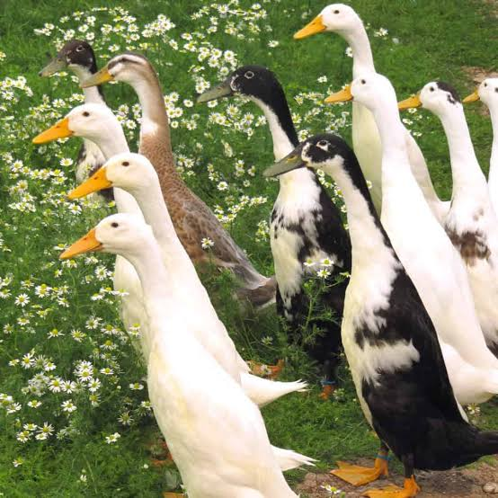
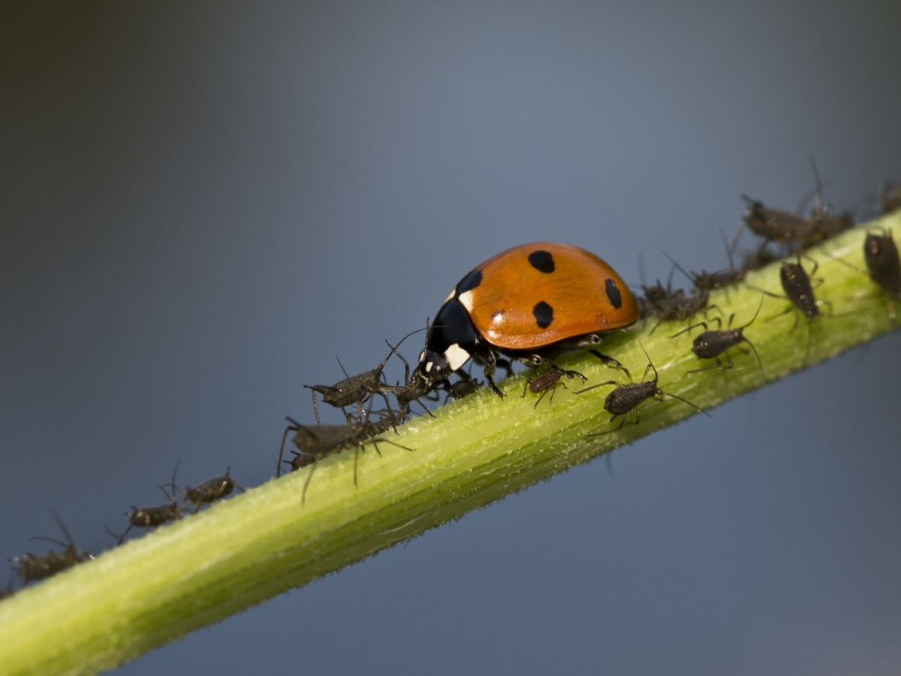

Les ennemis du potager
======================

Limaces et escargots
--------------------

Certaines personnes semblent prôner le "ne rien faire".
Ces personnes estiment que ca n'est pas très grave de perdre quelques salades sur l'ensemble des cultures.

Le paillis semble être un terrain favorable à la reproduction des limaces.

Si le problème est vraiment trop important, il est possible de mettre en place des barrières à limace autour des plantations:

.. image:: ../_static/images/barriere_a_limaces.jpg
   :width: 200

Mais la meilleure solution à ce problème semble avant tout d'être de prendre des :ref:`canards coureurs indiens <Canards coureurs indiens>`.

Pucerons
--------

Ces ravageurs sont extrêmement nuisibles et peuvent décimer des cultures entières.

Une solution complètement naturelle contre ceux-ci et qui est de surcroit très efficace, est la présence de coccinelles sur le terrain.

Les coccinelles sont vraisemblablement très friandes des fèves, de la capucine, de l’absinthe, de la bourrache, des orties ou encore de la carotte sauvage.
En planter permettrait donc de créer un terrain favorable à l'installation de celles-ci.

Si attirer les coccinelles par des voies naturelles ne fonctionne pas, il est possible de créer un élevage en terrarium ou simplement d'acheter des larves dans le commerce.

Afin qu'elles restent sur le terrain, il faut bien entendu qu'elles aient de quoi s'abriter et se reproduire (un bout de terrain laissé à l'abandon où la nature reprend ses droits, ou encore un hôtel de bois placé en hauteur dans les arbres).

