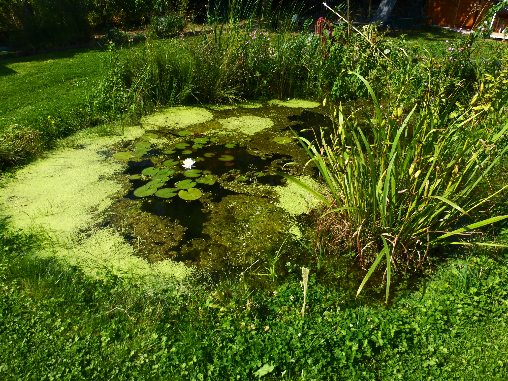

Mare
====

Favorise la biodiversité.

Pour une mare de moins de 10 m² : aucune autorisation de travaux n'est nécessaire. Pour une mare de 10 à 100 m² : vous devez remplir une déclaration de travaux à la mairie.

Contre les moustiques:

- :ref:`Canards coureurs indiens`
- Poissons mangeurs de moustiques (ides mélanotes, vairons communs, poissons rouges, etc.)

