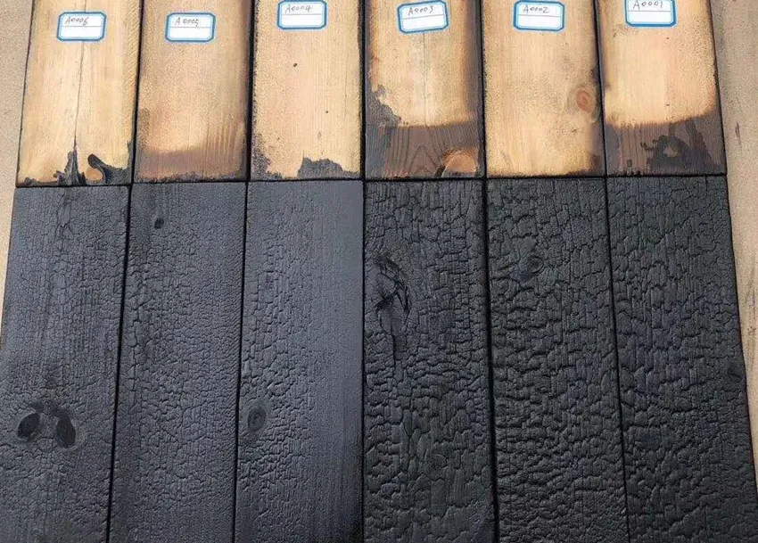

Structures en bois
==================

Pour faire des structures dans le jardin (tuteurs, arches, etc.), il est recommandé de bruler le bois, cette technique est appelée `Yakisugi <https://fr.wikipedia.org/wiki/Yakisugi>`_.

Avantages de brûler le bois:

- Résistance au feu
- Résistance aux insectes xylophages
- Résistance aux champignons lignivores (qui endommagent la structure et réduit la capacité structurelle du bois, en gros il pourrit)
- Complètement naturel et facile à faire, pas besoin d'avoir recours à des produits chimiques de protection

