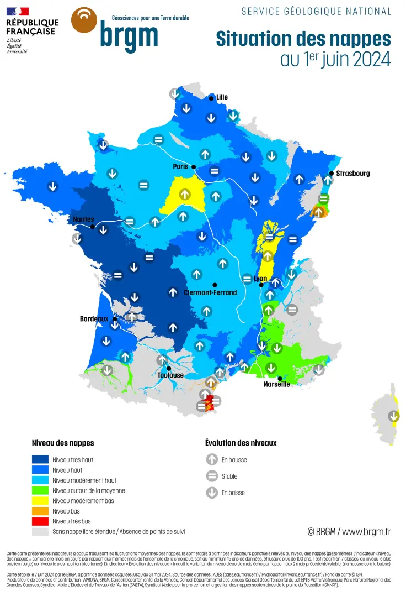

.. role:: red_cell
.. role:: green_cell

Choix de la région
==================

L'objectif de cette étude est de trouver une région proche de la montagne dans laquelle s'installer.

Différents paramètres seront pris en compte:

- Le climat (d'un point de vue confort mais aussi d'un point de vue agricole)
- La pollution de l'air
- La pollution des sols
- Les risques naturels induits ou non par le réchauffement climatique

Cette étude a pour vocation d'être quantitative plus que qualitative et ne s'intéresse pas aux différents micro climats qu'il peut y avoir au sein d'une même région.

Les zones géographiques visées sont:

- Les Pyrénées
- Les Alpes
- Le massif central

Afin de faciliter l'étude, une ville de référence dans chacun des départements concernés a été choisie de manière arbitraire.

À noter que monter trop haut en altitude peut entrainer de nombreuses complications telles que:

- Isolement social
- Difficultés à acheminer des matériaux 
- Difficultés à cultiver (gel)
- etc.

C'est pourquoi dans le cadre de cette étude, l'altitude visée est de 300 mètres au dessus du niveau de la mer (à +- 100m).

Villes retenues:

+-------------------+-----------------------------+------------------+----------------+
| **Nom**           | **Département**             | **Altitude (m)** | **Population** |
+-------------------+-----------------------------+------------------+----------------+
| Annecy            | Haute-Savoie                | 452              | 49232          |
+-------------------+-----------------------------+------------------+----------------+
| Chambéry          | Savoie                      | 279              | 61640          |
+-------------------+-----------------------------+------------------+----------------+
| Volx              | Alpes-de-Haute-Provence     | 379              | 2890           |
+-------------------+-----------------------------+------------------+----------------+
| Carros            | Alpes-Maritimes             | 390              | 10883          |
+-------------------+-----------------------------+------------------+----------------+
| Urepel            | Pyrénées-Atlantiques        | 419              | 390            |
+-------------------+-----------------------------+------------------+----------------+
| Tarbes            | Hautes-Pyrénées             | 316              | 52106          |
+-------------------+-----------------------------+------------------+----------------+
| Saint-Gaudens     | Haute-Garonne               | 411              | 12193          |
+-------------------+-----------------------------+------------------+----------------+
| Foix              | Ariège                      | 392              | 9860           |
+-------------------+-----------------------------+------------------+----------------+
| Joch              | Pyrénées-Orientales         | 390              | 159            |
+-------------------+-----------------------------+------------------+----------------+
| Maurs             | Cantal                      | 291              | 2269           |
+-------------------+-----------------------------+------------------+----------------+

Étude du climat
---------------

Les différentes données sont des moyennes calculées entre 2010 et 2023.

TODO: AJOUTER TEMPERATURE RESSENTIE

En hiver
~~~~~~~~

+---------------------------------------------------------------------+-------------------+------------------+--------------------+--------------------+--------------------+------------+-------------------+----------+--------------------+-----------+
| **Métrique**                                                        | **Annecy**        | **Chambéry**     | **Volx**           | **Carros**         | **Urepel**         | **Tarbes** | **Saint-Gaudens** | **Foix** | **Joch**           | **Maurs** |
+---------------------------------------------------------------------+-------------------+------------------+--------------------+--------------------+--------------------+------------+-------------------+----------+--------------------+-----------+
| Température moyenne (°C)                                            | :red_cell:`2.38`  | 3.87             | 4.51               | 5.57               | 6.10               | 5.83       | 5.52              | 5.77     | 6.45               | 5.37      |
+---------------------------------------------------------------------+-------------------+------------------+--------------------+--------------------+--------------------+------------+-------------------+----------+--------------------+-----------+
| Température journalière min moyenne (°C)                            | :red_cell:`-0.96` | 0.60             | -0.02              | 1.61               | :green_cell:`3.09` | 1.94       | 1.56              | 2.22     | 2.92               | 2.48      |
+---------------------------------------------------------------------+-------------------+------------------+--------------------+--------------------+--------------------+------------+-------------------+----------+--------------------+-----------+
| Température journalière max moyenne (°C)                            | :red_cell:`6.08`  | 7.51             | 10.04              | 10.20              | 9.57               | 10.45      | 10.20             | 9.92     | 10.72              | 8.85      |
+---------------------------------------------------------------------+-------------------+------------------+--------------------+--------------------+--------------------+------------+-------------------+----------+--------------------+-----------+
| Précipitations pluie (mm)                                           | 2.92              | 3.03             | 1.73               | 2.28               | 4.26               | 3.04       | 2.83              | 2.74     | 1.51               | 3.02      |
+---------------------------------------------------------------------+-------------------+------------------+--------------------+--------------------+--------------------+------------+-------------------+----------+--------------------+-----------+
| Précipitations neige (mm)                                           | :red_cell:`7.85`  | :red_cell:`7.66` | 1.13               | 1.52               | :red_cell:`4.69`   | 1.25       | 1.55              | 2.85     | 0.81               | 1.32      |
+---------------------------------------------------------------------+-------------------+------------------+--------------------+--------------------+--------------------+------------+-------------------+----------+--------------------+-----------+
| Vitesse du vent moyenne 10m au dessus du sol (km/h)                 | 8.80              | 8.56             | 15.47              | 11.96              | 17.07              | 13.89      | 14.37             | 15.80    | 14.64              | 15.99     |
+---------------------------------------------------------------------+-------------------+------------------+--------------------+--------------------+--------------------+------------+-------------------+----------+--------------------+-----------+
| Nombre d'heures d'ensolleillement par jour                          | 5.47              | :red_cell:`5.29` | :green_cell:`6.80` | :green_cell:`6.88` | 5.47               | 5.88       | 5.97              | 5.80     | :green_cell:`7.17` | 5.15      |
+---------------------------------------------------------------------+-------------------+------------------+--------------------+--------------------+--------------------+------------+-------------------+----------+--------------------+-----------+
| Nombre d'heures de pluie par jour (pas une durée mais une quantité) | 6.05              | 6.13             | :green_cell:`2.92` | 3.21               | 7.41               | 5.82       | 5.58              | 5.76     | :green_cell:`2.74` | 5.76      |
+---------------------------------------------------------------------+-------------------+------------------+--------------------+--------------------+--------------------+------------+-------------------+----------+--------------------+-----------+
| Nombre d'heures où il fait jour                                     | 9.38              | 9.41             | 9.57               | 9.58               | 9.65               | 9.63       | 9.64              | 9.65     | 9.68               | 9.49      |
+---------------------------------------------------------------------+-------------------+------------------+--------------------+--------------------+--------------------+------------+-------------------+----------+--------------------+-----------+
| Evapotranspiration (mm)                                             | 0.68              | 0.70             | 1.10               | 1.07               | 0.93               | 0.95       | 1.00              | 0.99     | 1.26               | 0.83      |
+---------------------------------------------------------------------+-------------------+------------------+--------------------+--------------------+--------------------+------------+-------------------+----------+--------------------+-----------+

En été
~~~~~~

+---------------------------------------------------------------------+------------+--------------+---------------------+------------------+-------------------+-------------------+-------------------+-------------------+----------+-----------+
| **Métrique**                                                        | **Annecy** | **Chambéry** | **Volx**            | **Carros**       | **Urepel**        | **Tarbes**        | **Saint-Gaudens** | **Foix**          | **Joch** | **Maurs** |
+---------------------------------------------------------------------+------------+--------------+---------------------+------------------+-------------------+-------------------+-------------------+-------------------+----------+-----------+
| Température moyenne (°C)                                            | 20.01      | 21.34        | 22.75               | 21.40            | 18.41             | 19.58             | 19.62             | 20.23             | 21.98    | 20.55     |
+---------------------------------------------------------------------+------------+--------------+---------------------+------------------+-------------------+-------------------+-------------------+-------------------+----------+-----------+
| Température journalière min moyenne (°C)                            | 14.87      | 16.42        | 15.79               | 16.75            | 14.28             | 14.87             | 14.87             | 15.51             | 17.11    | 15.56     |
+---------------------------------------------------------------------+------------+--------------+---------------------+------------------+-------------------+-------------------+-------------------+-------------------+----------+-----------+
| Température journalière max moyenne (°C)                            | 24.87      | 25.92        | :red_cell:`29.15`   | 25.33            | 23.23             | 24.37             | 24.40             | 25.05             | 27.09    | 25.49     |
+---------------------------------------------------------------------+------------+--------------+---------------------+------------------+-------------------+-------------------+-------------------+-------------------+----------+-----------+
| Précipitations pluie (mm)                                           | 3.23       | 3.33         | :red_cell:`1.13`    | :red_cell:`1.20` | 2.73              | 2.76              | 2.73              | 2.30              | 2.16     | 2.21      |
+---------------------------------------------------------------------+------------+--------------+---------------------+------------------+-------------------+-------------------+-------------------+-------------------+----------+-----------+
| Précipitations neige (mm)                                           | 0.00       | 0.00         | 0.00                | 0.00             | 0.00              | 0.00              | 0.00              | 0.00              | 0.00     | 0.00      |
+---------------------------------------------------------------------+------------+--------------+---------------------+------------------+-------------------+-------------------+-------------------+-------------------+----------+-----------+
| Vitesse du vent moyenne 10m au dessus du sol (km/h)                 | 9.76       | 9.75         | :green_cell:`17.96` | 11.15            | 14.20             | 12.39             | 12.59             | 13.45             | 14.57    | 13.80     |
+---------------------------------------------------------------------+------------+--------------+---------------------+------------------+-------------------+-------------------+-------------------+-------------------+----------+-----------+
| Nombre d'heures d'ensolleillement par jour                          | 11.80      | 11.76        | 12.90               | 12.90            | :red_cell:`10.51` | :red_cell:`10.61` | :red_cell:`10.73` | :red_cell:`10.85` | 12.42    | 11.61     |
+---------------------------------------------------------------------+------------+--------------+---------------------+------------------+-------------------+-------------------+-------------------+-------------------+----------+-----------+
| Nombre d'heures de pluie par jour (pas une durée mais une quantité) | 4.14       | 4.32         | 1.39                | 2.06             | :red_cell:`5.25`  | 4.20              | 4.09              | 3.95              | 2.81     | 3.29      |
+---------------------------------------------------------------------+------------+--------------+---------------------+------------------+-------------------+-------------------+-------------------+-------------------+----------+-----------+
| Nombre d'heures où il fait jour                                     | 15.02      | 14.98        | 14.81               | 14.79            | 14.73             | 14.75             | 14.73             | 14.72             | 14.69    | 14.90     |
+---------------------------------------------------------------------+------------+--------------+---------------------+------------------+-------------------+-------------------+-------------------+-------------------+----------+-----------+
| Evapotranspiration (mm)                                             | 4.17       | 4.24         | :red_cell:`5.71`    | 4.49             | 3.74              | 3.83              | 3.90              | 4.13              | 4.88     | 4.49      |
+---------------------------------------------------------------------+------------+--------------+---------------------+------------------+-------------------+-------------------+-------------------+-------------------+----------+-----------+

Analyse
~~~~~~~

D'un point de vue agricole, une métrique particulièrement intéressante est l'évapotranspiration.
Celle-ci représente la quantité d'eau qui s'évapore du sol et des plantes pour aller dans l'atmosphère.
Plus l'évapotranspiration est importante, plus un apport d'eau sur les cultures sera nécessaire.

Ci-dessous se trouve un tableau qui met en exergue le ratio entre la quantité de pluie qui tombe, et la quantité d'eau qui s'évapore.
Ce tableau se concentre sur le cas le plus défavorable, à savoir l'été (où il pleut généralement moins, et les températures sont plus élevées).
Plus cette valeur est proche de 1, plus cultiver dans ce sol est intéressant.

+-------------------+---------------------------------------------+
| **Ville**         | **Ratio précipitations/évapotranspiration** |
+-------------------+---------------------------------------------+
| Annecy            | 0.77                                        |
+-------------------+---------------------------------------------+
| Chambéry          | 0.79                                        |
+-------------------+---------------------------------------------+
| Volx              | :red_cell:`0.20`                            |
+-------------------+---------------------------------------------+
| Carros            | :red_cell:`0.27`                            |
+-------------------+---------------------------------------------+
| Urepel            | 0.73                                        |
+-------------------+---------------------------------------------+
| Tarbes            | 0.72                                        |
+-------------------+---------------------------------------------+
| Saint-Gaudens     | 0.70                                        |
+-------------------+---------------------------------------------+
| Foix              | 0.56                                        |
+-------------------+---------------------------------------------+
| Joch              | 0.44                                        |
+-------------------+---------------------------------------------+
| Maurs             | 0.49                                        |
+-------------------+---------------------------------------------+

La pluie n'est bien entendu pas le seul moyen d'irriguer les plantations, mais ça reste tout de même le vecteur le plus important.

Sources d'eau
-------------

Analyse de risques
------------------

L'indice de qualité de l'air est une moyenne calculée entre 2022 à 2024.

+-------------------------------------------------------------------------------------------+--------------------+--------------------+----------+--------------------+---------------------+------------+-------------------+----------+----------------------+-----------+
| **Métrique**                                                                              | **Annecy**         | **Chambéry**       | **Volx** | **Carros**         | **Urepel**          | **Tarbes** | **Saint-Gaudens** | **Foix** | **Joch**             | **Maurs** |
+-------------------------------------------------------------------------------------------+--------------------+--------------------+----------+--------------------+---------------------+------------+-------------------+----------+----------------------+-----------+
| Indice de qualité de l'air moyen                                                          | 28                 | 28                 | 27       | :red_cell:`33`     | 27                  | 26         | 25                | 27       | 27                   | 26        |
+-------------------------------------------------------------------------------------------+--------------------+--------------------+----------+--------------------+---------------------+------------+-------------------+----------+----------------------+-----------+
| Indice de qualité de l'air max (pics de pollution)                                        | 71                 | 71                 | 63       | 72                 | :red_cell:`112`     | 68         | 68                | 64       | :green_cell:`58`     | 66        |
+-------------------------------------------------------------------------------------------+--------------------+--------------------+----------+--------------------+---------------------+------------+-------------------+----------+----------------------+-----------+
| Nombre de catastrophes naturelles recensées dans la base GASPAR                           | 19                 | 12                 | 5        | 19                 | 14                  | 16         | 19                | 14       | 9                    | 6         |
+-------------------------------------------------------------------------------------------+--------------------+--------------------+----------+--------------------+---------------------+------------+-------------------+----------+----------------------+-----------+
| Nombre d'incidents recensés dans la base BASOL ayants entrainé une pollution des sols     | :red_cell:`24`     | :red_cell:`11`     | 0        | 0                  | 0                   | 1          | 2                 | 0        | 0                    | 0         |
+-------------------------------------------------------------------------------------------+--------------------+--------------------+----------+--------------------+---------------------+------------+-------------------+----------+----------------------+-----------+

Sources
-------

- `API open-source de météo <https://open-meteo.com>`_
- `Base de données GASPAR recensant les catastrophes naturelles <https://www.data.gouv.fr/fr/datasets/base-nationale-de-gestion-assistee-des-procedures-administratives-relatives-aux-risques-gaspar/>`_
- `Base de données BASOL recensant les sols pollués <https://www.data.gouv.fr/en/datasets/base-des-sols-pollues/>`_
- `Bureau de Recherches Géologiques et Minières <https://www.brgm.fr/fr/actualite/communique-presse/nappes-eau-souterraine-au-1er-juin-2024>`_
