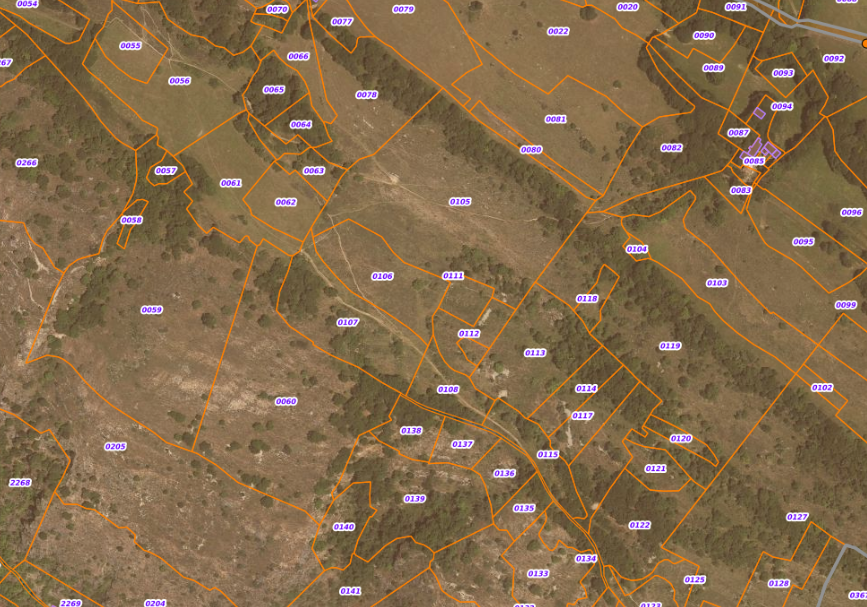
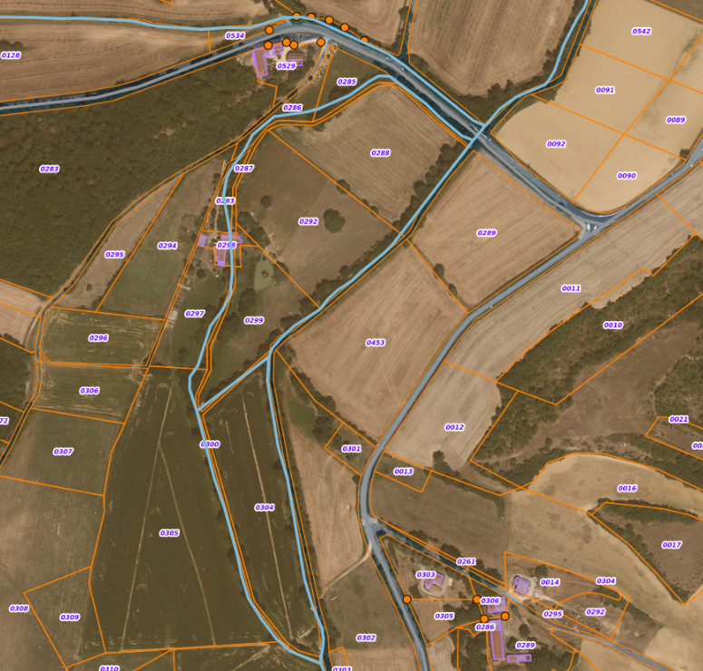
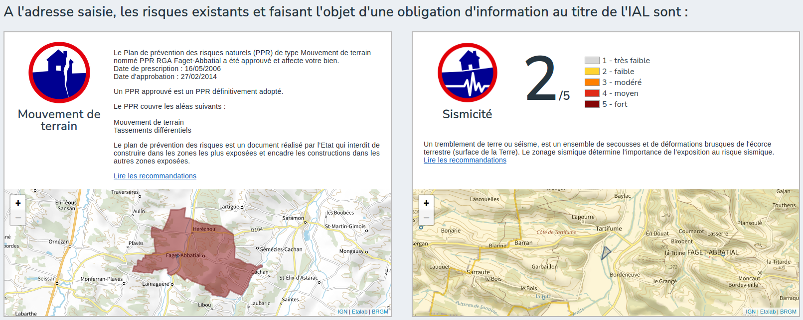

Choix du terrain
================

Une fois que vous avez identifié la région dans laquelle vous souhaitez vous installer, il convient de s'intéresser de manière un peu plus micro aux différents terrains qui constituent cette région.

Il va sans dire que votre étude se portera sur les terrains disponibles à la vente au moment de vos recherches.

Ressources gouvernementales
---------------------------

La `carte du site geoportail <https://www.geoportail.gouv.fr/carte>`_ vous permet d'observer en vue aérienne la division parcellaire d'une région grâce au calque "Parcelles cadastrales":

Il est également possible de superposer les calques, si par exemple vous recherchez un terrain avec un cours d'eau, vous pouvez ajouter le calque "Cours d'eau BCAE" qui fera apparaitre des lignes bleues sur la carte:

Un autre facteur important à prendre en compte sont les risques auxquels votre terrain peut-être sujet (zone innondable, risques sismiques, etc.).
Cette information n'est pas simplement accessible directement au travers de la carte du site geoportail, mais peut-être obtenue en utilisant le site `georisques <https://errial.georisques.gouv.fr>`_.

Définir ses critères
--------------------

Comme pour le choix de la région, choisir son terrain est un choix personnel où chacun aura ses préférences.

Cette section de la Babospédie a pour vocation de dresser une liste de critères qu'il vous revient de prioriser en fonction de vos objectifs.

Le terrain parfait n'existant probablement pas, il vous sera parfois nécessaire de faire certaines concessions,
c'est pourquoi cette liste est découpée en plusieurs catégories:

- Conditions primaires: les critères que vous jugez indispensables à la réalisation de votre projet, ce sont les conditions auxquelles vous ne dérogerez pas.
- Conditions secondaires: les critères que vous estimez particulièrement importants, mais sur lesquels vous seriez prêts à faire de petites concessions si vous ne trouvez pas de terrain qui y répond entièrement.
- Conditions tertiaire: les critères qui ne sont pas indispensables à la réalisation de votre projet mais qui seraient un atout non négligeable

Nous avons déjà catégorisé certains critères à des fins d'illustration, mais vous pouvez réorganiser ceux-ci comme bon vous semble en effectuant un glisser-déposer à l'aide des boutons .

Conditions primaires
~~~~~~~~~~~~~~~~~~~~

- Terrain constructible
- Proximité avec une ville de taille raisonnable
- Présence d'eau sur le terrain (nappe phréatique, veine, source de montagne, etc.)
- Sol non sableux (difficultés à cultiver)

Conditions secondaires
~~~~~~~~~~~~~~~~~~~~~~

- Exposé plein sud
- Terrain qui n'est pas en cuvette (rétention d'eau, pollution de l'air, etc.)
- Qualité du voisinage (utilisation de pesticides par les agriculteurs voisins, etc.)

Conditions tertiaires
~~~~~~~~~~~~~~~~~~~~~

- Arbres fruitiers déjà présents
- Présence d'une forêt sur le terrain pour avoir accès à une matière première que l'on peut travailler
- Mairie de gauche (regarder les projets en cours menés par celle-ci)
- Bâtisse existante (corps de ferme, bungalow, etc.)
- Source d'eau en hauteur pour utiliser la gravité et ne pas avoir besoin de pompe pour acheminer l'eau.
- Proximité avec l'océan ou la mer
- Proximité avec la montagne

.. raw:: html

  
  

Conformité avec les normes d'urbanisme de la commune
----------------------------------------------------

Consulter le plan local d'urbanisme (PLU) de la commune visée pour connaître les règles exactes et savoir ce que vous ne pourrez pas faire.

`Cette carte interactive <https://www.geoportail-urbanisme.gouv.fr/map/>`_ vous permet d'accéder facilement aux documents d'urbanisme relatifs à la commune visée.

Limite du nombre de maisons sur un terrain
-------------------------------------------

- Dépend de la surface du terrain
- S'assurer que la densité de construction permise est respectée (faire des maisons à étage aide à gagner de la surface au sol)
- Se référer au plan local d'urbanisme (PLU), spécifique à chaque commune
- Une division parcellaire semble nécessaire dans la plupart des cas
- Les habitats légers permettent de contourner certaines restrictions.
