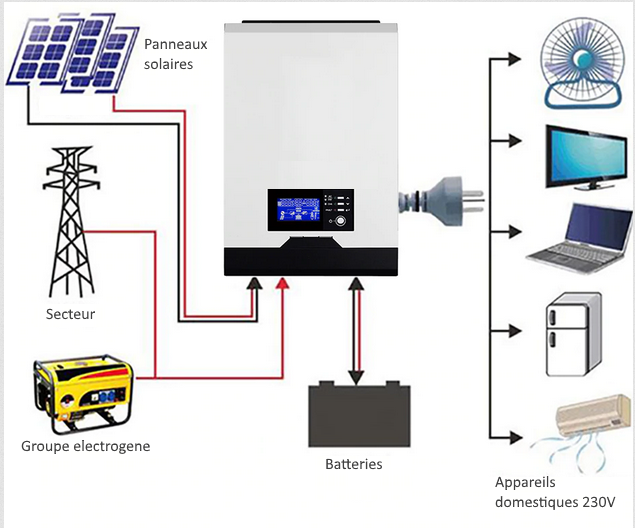
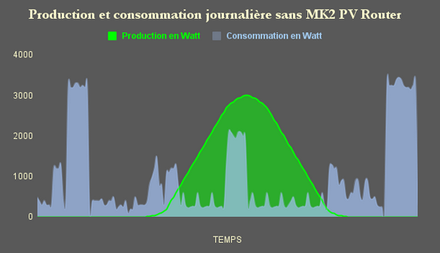
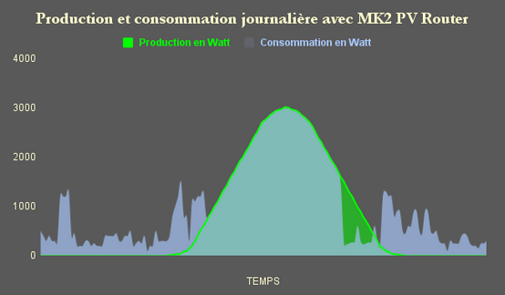

.. role:: red_cell
.. role:: green_cell

Autonomie énergétique
=====================

Il existe deux principaux montages réalisables lorsque l'on décide de produire soi-même son énergie:

- Le montage hors réseau: l'énergie produite est stockée dans des batteries qui restituent l'énergie dans l'habitat lorsque les sources de production d'énergie ne sont plus en fonctionnement (ex: la nuit pour les panneaux solaires)
- L'autoconsommation: l'énergie que l'on produit est en priorité utilisée dans l'habitat, le surplus est revendu à EDF. Ne nécessite pas de batteries.

L'autoconsommation ne permet pas d'être autonome pour des raisons légales.
Si une coupure a lieu sur le réseau public, la production de vos panneaux solaires sera également coupée.
La principale raison de cette limitation légale est le fait que si des techniciens interviennent sur le réseau public,
ils vont être amenés à couper le courant pour ne pas s'électrocuter,
continuer d'injecter sa production dans le réseau public pourrait alors être dangereux pour eux.

De nouveaux équipements arrivent sur la marché qui permettent de passer d'un mode à l'autre,
voire d'adopter des stratégies de consommation, par exemple en fonction de l'état de la production
ainsi que de l'état de charge des batteries. Voir la section :ref:`choix de l'onduleur <Choix de l'onduleur>`.

Chercher à être complètement autonome sans perdre en confort nécessite une installation solaire conséquente, ainsi que de faire quelques concessions sur sa consommation.
C'est pourquoi il n'est pas forcément utile de chercher une autonomie absolue, mais plutôt de dimensionner son installation en fonction de son besoin minimal, avec perte de confort.

Sources:

- `Avoir de l'électricité sans le réseau public <https://www.youtube.com/watch?v=uNpGS5BydOQ>`_

Stockage de l'énergie
---------------------

Pour entreposer les batteries, il faudra prévoir un local bien aéré car les batteries supportent mal les températures extrêmes.
Plus votre lieu de stockage se rapproche des conditions idéales pour vos batteries, plus leur durée de vie sera importante.

.. warning::

   Le choix du type de batteries doit être adapté à l'utilisation que vous comptez en faire.

Il existe un vaste panel de batteries qui ont toutes leurs avantages et leurs inconvénients.
Nous allons ici nous concentrer sur les batteries qui sont le plus couramment utilisées dans un contexte d'autonomie énergétique.

+---------------+------------+------------+----------------------------+-----------------------+-------------------------+--------------------------------------------------------------+-----------------------------+----------------------+-------------------------+-----------------------+-------------------+-------------------+----------------+-------------------------------------------------------+
| **Catégorie** | **Type**   | **Prix**   | **Impact environnemental** | **Reconditionnement** | **Profondeur décharge** | **Nombre de cycles (fonction de la profondeur de décharge)** | **Durée de vie calendaire** | **Vitesse décharge** | **Densité énergétique** | **Décharge profonde** | **Effet mémoire** | **Rendement**     | **BMS**        | **Entretien**                                         |
+---------------+------------+------------+----------------------------+-----------------------+-------------------------+--------------------------------------------------------------+-----------------------------+----------------------+-------------------------+-----------------------+-------------------+-------------------+----------------+-------------------------------------------------------+
| Plomb         | Acide      | €          | Fort                       | Possible en envoyant  | 70%                     | - 800 cycles à 30%                                           | :red_cell:`3 à 5 ans`       | Lente                | Faible                  | :red_cell:`Très       | Faible            | 80%               | Non nécessaire | - Non étanche                                         |
|               |            |            |                            | des impulsions élec\  |                         | - 500 cycles à 50%                                           |                             |                      |                         | sensible`             |                   |                   |                | - :red_cell:`Ajout régulier d'eau distillée`          |
|               |            |            |                            | triques de 300-400A.  |                         | - 300 cycles à 70%                                           |                             |                      |                         |                       |                   |                   |                | - Vérifier que les connexions ne sont pas corrodées   |
|               |            |            |                            | Processus complexe et |                         |                                                              |                             |                      |                         |                       |                   |                   |                |                                                       |
|               |            |            |                            | avec de faibles       |                         |                                                              |                             |                      |                         |                       |                   |                   |                |                                                       |
|               |            |            |                            | chances de succès     |                         |                                                              |                             |                      |                         |                       |                   |                   |                |                                                       |
|               +------------+------------+----------------------------+-----------------------+-------------------------+--------------------------------------------------------------+-----------------------------+----------------------+-------------------------+-----------------------+-------------------+-------------------+----------------+-------------------------------------------------------+
|               | AGM        | €€         | Fort                       | Possible en envoyant  | 80%                     | - 1500 cycles à 30%                                          | :red_cell:`5 à 8 ans`       | Moyenne              | Faible                  | Sensibilité moyenne   | Faible            | 95%               | Non nécessaire | - Étanche                                             |
|               |            |            |                            | des impulsions élec\  |                         | - 600 cycles à 50%                                           |                             |                      |                         |                       |                   |                   |                | - Quasiment aucun entretien                           |
|               |            |            |                            | triques de 300-400A.  |                         | - 400 cycles à 70%                                           |                             |                      |                         |                       |                   |                   |                |                                                       |
|               |            |            |                            | Processus complexe et |                         |                                                              |                             |                      |                         |                       |                   |                   |                |                                                       |
|               |            |            |                            | avec de faibles       |                         |                                                              |                             |                      |                         |                       |                   |                   |                |                                                       |
|               |            |            |                            | chances de succès     |                         |                                                              |                             |                      |                         |                       |                   |                   |                |                                                       |
|               +------------+------------+----------------------------+-----------------------+-------------------------+--------------------------------------------------------------+-----------------------------+----------------------+-------------------------+-----------------------+-------------------+-------------------+----------------+-------------------------------------------------------+
|               | Gel        | €€         | Fort                       | Possible en envoyant  | 90%                     | - 1800 cycles à 30%                                          | :red_cell:`5 à 10 ans`      | Lente                | Faible                  | Sensibilité moyenne   | Faible            | 90%               | Non nécessaire | - Étanche                                             |
|               |            |            |                            | des impulsions élec\  |                         | - 750 cycles à 50%                                           |                             |                      |                         |                       |                   |                   |                | - Quasiment aucun entretien                           |
|               |            |            |                            | triques de 300-400A.  |                         | - 500 cycles à 70%                                           |                             |                      |                         |                       |                   |                   |                |                                                       |
|               |            |            |                            | Processus complexe et |                         |                                                              |                             |                      |                         |                       |                   |                   |                |                                                       |
|               |            |            |                            | avec de faibles       |                         |                                                              |                             |                      |                         |                       |                   |                   |                |                                                       |
|               |            |            |                            | chances de succès     |                         |                                                              |                             |                      |                         |                       |                   |                   |                |                                                       |
|               +------------+------------+----------------------------+-----------------------+-------------------------+--------------------------------------------------------------+-----------------------------+----------------------+-------------------------+-----------------------+-------------------+-------------------+----------------+-------------------------------------------------------+
|               | OPzS       | €€€        | Fort                       | Possible en envoyant  | 80%                     | - 4400 cycles à 30%                                          | 15 à 20 ans                 | Rapide               | Faible                  | Sensibilité moyenne   | Faible            | 85%               | Non nécessaire | - Non étanche                                         |
|               |            |            |                            | des impulsions élec\  |                         | - 2500 cycles à 50%                                          |                             |                      |                         |                       |                   |                   |                | - :red_cell:`Ajout régulier d'acide sulfurique dilué` |
|               |            |            |                            | triques de 300-400A.  |                         | - 1350 cycles à 70%                                          |                             |                      |                         |                       |                   |                   |                |                                                       |
|               |            |            |                            | Processus complexe et |                         |                                                              |                             |                      |                         |                       |                   |                   |                |                                                       |
|               |            |            |                            | avec de faibles       |                         |                                                              |                             |                      |                         |                       |                   |                   |                |                                                       |
|               |            |            |                            | chances de succès     |                         |                                                              |                             |                      |                         |                       |                   |                   |                |                                                       |
|               +------------+------------+----------------------------+-----------------------+-------------------------+--------------------------------------------------------------+-----------------------------+----------------------+-------------------------+-----------------------+-------------------+-------------------+----------------+-------------------------------------------------------+
|               | OPzV       | €€€        | Fort                       | Possible en envoyant  | 80%                     | - 4600 cycles à 30%                                          | 15 à 20 ans                 | Rapide               | Faible                  | Sensibilité moyenne   | Faible            | 85%               | Non nécessaire | - Étanche                                             |
|               |            |            |                            | des impulsions élec\  |                         | - 2600 cycles à 50%                                          |                             |                      |                         |                       |                   |                   |                | - Quasiment aucun entretien                           |
|               |            |            |                            | triques de 300-400A.  |                         | - 1400 cycles à 70%                                          |                             |                      |                         |                       |                   |                   |                |                                                       |
|               |            |            |                            | Processus complexe et |                         |                                                              |                             |                      |                         |                       |                   |                   |                |                                                       |
|               |            |            |                            | avec de faibles       |                         |                                                              |                             |                      |                         |                       |                   |                   |                |                                                       |
|               |            |            |                            | chances de succès     |                         |                                                              |                             |                      |                         |                       |                   |                   |                |                                                       |
+---------------+------------+------------+----------------------------+-----------------------+-------------------------+--------------------------------------------------------------+-----------------------------+----------------------+-------------------------+-----------------------+-------------------+-------------------+----------------+-------------------------------------------------------+
| Lithium       | Fer        | €€€€       | :red_cell:`Très fort`      | Possible de changer   | 95%                     | - 10000 cycles à 30%                                         | 10 à 15 ans                 | Plutôt rapide        | Forte                   | Peu sensible          | Très faible       | :green_cell:`95%` | Nécessaire     | - Étanche                                             |
|               | Phosphate  |            |                            | les cellules          |                         | - 4500 cycles à 50%                                          |                             |                      |                         |                       |                   |                   | pour réguler   | - Quasiment aucun entretien                           |
|               |            |            |                            | défectueuses mais     |                         | - 3000 cycles à 70%                                          |                             |                      |                         |                       |                   |                   | la tension     |                                                       |
|               |            |            |                            | pas de les réparer    |                         |                                                              |                             |                      |                         |                       |                   |                   |                |                                                       |
|               +------------+------------+----------------------------+-----------------------+-------------------------+--------------------------------------------------------------+-----------------------------+----------------------+-------------------------+-----------------------+-------------------+-------------------+----------------+-------------------------------------------------------+
|               | Ion        | €€€€€      | :red_cell:`Très fort`      | Possible de changer   | 95%                     | - 20000 cycles à 30%                                         | :red_cell:`5 à 10 ans`      | Plutôt rapide        | Forte                   | Peu sensible          | Très faible       | :green_cell:`97%` | Nécessaire     | - Étanche                                             |
|               |            |            |                            | les cellules          |                         | - 9000 cycles à 50%                                          |                             |                      |                         |                       |                   |                   | pour réguler   | - Quasiment aucun entretien                           |
|               |            |            |                            | défectueuses mais     |                         | - 6000 cycles à 70%                                          |                             |                      |                         |                       |                   |                   | la tension     |                                                       |
|               |            |            |                            | pas de les réparer    |                         |                                                              |                             |                      |                         |                       |                   |                   |                |                                                       |
+---------------+------------+------------+----------------------------+-----------------------+-------------------------+--------------------------------------------------------------+-----------------------------+----------------------+-------------------------+-----------------------+-------------------+-------------------+----------------+-------------------------------------------------------+
| Nickel        | Fer        | €€€€€      | :green_cell:`Relativement  | :green_cell:`Changer  | 85%                     | - 6000 cycles à 30%                                          | :green_cell:`30 à 50 ans`   | Rapide               | Faible                  | Peu sensible          | Faible            | 80%               | Non nécessaire | - Non étanche                                         |
|               |            |            | faible`                    | l'électrolyte (KOH)   |                         | - 3000 cycles à 50%                                          |                             |                      |                         |                       |                   |                   |                | - :red_cell:`Ajout régulier d'eau distillée`          |
|               |            |            |                            | permet de remettre la |                         | - 1700 cycles à 70%                                          |                             |                      |                         |                       |                   |                   |                | - Prévoir de changer l'électrolyte tous les ~10 ans   |
|               |            |            |                            | batterie presque à    |                         | - Remise quasi à neuf sur changement de l'électrolyte        |                             |                      |                         |                       |                   |                   |                |                                                       |
|               |            |            |                            | neuf`                 |                         |                                                              |                             |                      |                         |                       |                   |                   |                |                                                       |
+---------------+------------+------------+----------------------------+-----------------------+-------------------------+--------------------------------------------------------------+-----------------------------+----------------------+-------------------------+-----------------------+-------------------+-------------------+----------------+-------------------------------------------------------+

Notes:

- Les données présentées dans le tableau peuvent varier grandement d'un constructeur à l'autre, ces nombres ont uniquement pour vocation de donner un ordre de grandeur.
- Batteries étanches/non-étanches : les batteries non-étanches nécessitent la mise à niveau de l'électrolyte (ajout d'un liquide), elles sont également davantage sujettes aux émanations de gaz et ne doivent pas être stockées dans les pièces de vie.
- L'autodécharge n'est pas comparée (elle est par exemple très forte sur les batteries Nickel-Fer) car ce critère est jugé non pertinent dans un contexte d'autonomie énergétique où les batteries sont rechargées tous les jours.

Recommandations:

- Utiliser des batteries au plomb si on veut ne veut pas payer trop cher
- Utiliser des batteries Lithium-Fer-Phosphate si on veut de bonnes performances et ne pas avoir besoin d'entretien régulier
- Utiliser des batteries Nickel-Fer si on souhaite privilégier la durabilité

Vidéo sur les batteries Nickel-Fer (en anglais):

.. raw:: html

    

        <iframe src="https://www.youtube.com/embed/PQ-Ibc1zCYk" frameborder="0" allowfullscreen style="position: absolute; top: 0; left: 0; width: 100%; height: 100%;"></iframe>
    

Sources:

- `Comment choisir ses batteries | différentes technologies de batterie <https://www.youtube.com/watch?v=GtZv9J5xkGg>`_
- `Lithium ou Plomb pour l'autonomie? <https://www.youtube.com/watch?v=mCm_lub3Xqk>`_
- `Fonctionnement, entretien et régénération de batteries au plomb <https://wiki.lowtechlab.org/wiki/Fonctionnement,_entretien_et_r%C3%A9g%C3%A9n%C3%A9ration_de_batteries_au_plomb>`_
- `Papier de recherche sur les batteries nickel-fer <https://www.researchgate.net/publication/269310928_Long-life_nickel_iron_battery_functionality_cost_comparison_for_peak_demand_SWER_network_voltage_support_application>`_
- `A better way to estimate battery lifetime <https://www.okrasolar.com/blog/a-better-way-to-estimate-battery-lifetime>`_

Choix de l'onduleur
-------------------

L'onduleur est l'équipement qui permet de gérer "intelligemment" l'électricité.
Il a pour rôle de transformer le courant continu en courant alternatif.
Mais aussi de rendre le courant propre en stabilisant sa fréquence (en utilisant l'électricité du réseau public comme référence).

.. warning::

    Les onduleurs conventionnels sont programmés pour se couper en cas de coupure du réseau public pour des raisons de sécurité.

    Seuls les onduleurs dits "hybrides" permettent de continuer à utiliser sa production en cas de coupure du réseau.
    Ils sont généralement plus difficiles à trouver et aussi plus chers.

C'est lui qui va être responsable de:

- Fournir directement l'habitat en électricité si nécessaire
- Mettre l'énergie produite dans les batteries si l'habitat n'utilise pas cette électricité
- Redistribuer l'énergie sur le réseau public en cas de surproduction (batteries pleines)
- Prendre l'électricité du réseau si les batteries sont vides

Installation de panneaux solaires
---------------------------------

Il existe trois principaux types de panneaux solaires:

+----------------+-------------------------------------------------------------------------+------------------------------------------------------------------------------------------+
| **Type**       | **Avantages**                                                           | **inconvénients**                                                                        |
+----------------+-------------------------------------------------------------------------+------------------------------------------------------------------------------------------+
| Photovoltaique | - Facilité d'installation                                               | - Nécessité d'avoir une maison ou un terrain bien exposé                                 |
|                | - Bon rapport qualité/prix                                              |                                                                                          |
|                | - Possibilité de revendre sa production                                 |                                                                                          |
|                | - Éligible aux subventions                                              |                                                                                          |
|                | - Idéal si on se chauffe à l'électrique                                 |                                                                                          |
+----------------+-------------------------------------------------------------------------+------------------------------------------------------------------------------------------+
| Thermique      | - Permet de produire de l'eau chaude sanitaire                          | - Production limitée                                                                     |
|                | - Particulièrement interessant si utilisation de chauffages hydroliques | - Installation complexe                                                                  |
|                | - Éligible à beaucoup d'aides                                           | - Ne fonctionne pas en dessous de 0°C                                                    |
+----------------+-------------------------------------------------------------------------+------------------------------------------------------------------------------------------+
| Hybride        | - Mélange entre photovoltaique et thermique                             | - Moins robuste car plus high-tech: si une face du panneau tombe en panne, l'autre aussi |
|                | - Éligible à beaucoup d'aides                                           |                                                                                          |
|                | - Plus cher                                                             |                                                                                          |
+----------------+-------------------------------------------------------------------------+------------------------------------------------------------------------------------------+

Il existe deux types principaux de panneaux solaires photovoltaiques, les panneaux dits "monocristalins" ainsi que les panneaux dits "polycristalins".

Les panneaux monocristalins ont un meilleur rendement, mais sont également plus chers.

.. warning::

   Avant de faire un quelconque montage, il faut bien s'assurer des limites de tension et d'intensité maximales supportées par votre matériel (ex: l'onduleur).

Il faut généralement prévoir plus de panneaux que de batteries.
Un montage en série permet d'augmenter la tension de sortie (addition des tensions de tous les panneaux en série).
Un montage en parallèle permet d'augmenter l'intensité de sortie (addition des intensités de tous les panneaux en série).
Le montage en parallèle nécessite des cables plus épais pour supporter le courant qui les traverse.
L'inclinaison idéale pour des panneaux solaires statiques (sur un toit) est de 60°.
Il est possible de mixer les montages.
La principale perte d'efficacité des panneaux solaires est due à la saleté, il faut les nettoyer régulièrement. C'est pour cette raison que mettre les panneaux au sol plutôt que sur un toit est une option à sérieusement considérer.
Faire attention à son emplacement, le soleil est plus rasant l'hiver.

Avantages de mettre ses panneaux au sol plutôt que sur des toits:

- Moins cher à installer
- Plus faciles à nettoyer (meilleur rendement quand propres)
- Refroidis par l'arrière (plus les panneaux sont froids, plus ils ont un rendement intéressant)
- Possibilité de parfaitement ajuster l'inclinaison et l'orientation (meilleur rendement également)

Attention aux subventions, il semblerait qu'elles ne sont pas les mêmes si les panneaux sont au sol ou sur le toit.

Démarches légales à effectuer:

- Déclaration préalable de travaux auprès de la mairie (possibilité de l'inclure dans celle de la maison)
- Déclaration ENEDIS
- Faire appel à un consuel qui viendra vérifier l'installation solaire (compter environ 200€)

En dessous de 3000W crête et si les panneaux sont installés à moins de 1m80 du sol, la déclaration auprès de la mairie n'est pas nécessaire.

Installation d'une éolienne
---------------------------

Selon la région évidemment, se renseigner sur les vitesses de vent moyennes à partir desquelles installer une éolienne devient intéressant.

Plus elles sont petites, plus les pales sont petites, et plus elles font de bruit.

Il en existe différents types:

- L'éolienne hélicoïdale à axe vertical: rendement faible (TODO: vérifier)

Groupe électrogène
------------------

Peut être utile dans les situations suivantes:

- Sur un chantier, lorsque l'habitat n'est pas encore équipé
- Habitat pas relié au réseau public et batteries à plat
- Réseau public hors service et batteries à plat
- Besoin d'électricité à un endroit trop éloigné de l'habitat (dans un champs par exemple)
- Pour recharger des batteries afin d'éviter les décharges profondes et ainsi prolonger leur durée de vie
- ...

Utiliser la prise allume-cigare de sa voiture peut être une alternative viable pour alimenter de petits équipements (lumières, laptop, etc.)

La qualité du courant en sortie d'un groupe électrogène n'est pas très bonne et peut endommager certains appareils sensibles (tels que des ordinateurs).
Certains groupes haut de gammes intègrent parfois des régulateurs visant à lisser le courant et le rendre plus propre.

.. danger::

   Ne pas utiliser en intérieur à cause des rejets dûs à la combustion (risque d'intoxication).

Économies d'énergie
-------------------

Réseau électrique 12 volts
~~~~~~~~~~~~~~~~~~~~~~~~~~

Nos équipements du quotidien (chargeur de smartphones, lumières, etc.) pourraient parfaitement fonctionner avec du 12 volts.
Seulement, les normes électrique font qu'aujourd'hui nous avons du 230 volts dans nos logements.
À chaque conversion de la tension (passage 12V à 230V, puis de 230V à 12V, etc.) une perte de 10 à 20% de rendement énergétique.
Cette perte peut devenir particulièrement importantes lorsque des batteries sont utilisées, étant donné que la tension est une première fois transformée en 230V, pour ensuite être de nouveau convertie en 12V.

Si vous en avez la possibilité, il peut être intéressant de prévoir dès la construction/rénovation de votre habitat, un réseau 12V en plus du 230V.

Adapter certains postes de dépenses en fonction de la production d'énergie
~~~~~~~~~~~~~~~~~~~~~~~~~~~~~~~~~~~~~~~~~~~~~~~~~~~~~~~~~~~~~~~~~~~~~~~~~~

Un équipement open-source appelé le `MK2 PVRouter <https://mk2pvrouter.com>`_ permet d'alimenter certains équipements que lorsqu'on est en surproduction énergétique.

Il est particulièrement adapté pour chauffer un chauffe-eau ou des radiateurs, lorsque la production d'énergie est au plus haut.

Supervision de sa consommation
~~~~~~~~~~~~~~~~~~~~~~~~~~~~~~

Plusieurs études semblent suggérer que le simple fait de pouvoir observer sa consommation énergétique en temps réel aurait tendance à faire baisser sa consommation.

Bien souvent, avoir la possibilité d'observer sa consommation en temps réel permet d'identifier les principaux postes de dépense énergétique et ainsi agir en conséquence.

Sources:

- `Analysis of the Effectiveness of the Utilization of Power Monitoring Devices in Reducing Electric Energy Consumption <https://www.researchgate.net/publication/338014332_Analysis_of_the_Effectiveness_of_the_Utilization_of_Power_Monitoring_Devices_in_Reducing_Electric_Energy_Consumption>`_
- `The effectiveness of feedback on energy consumption <https://uploads-ssl.webflow.com/62ce9c70f858d840fb13f5f5/6304d1c69fe34b25b56ed28e_Darby%202006%20-%20The%20effectiveness%20of%20feedback%20on%20energy%20consumption.pdf>`_

