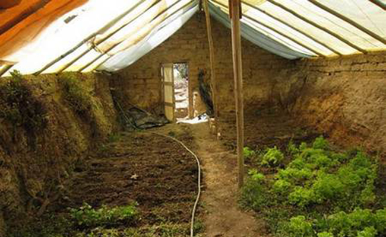
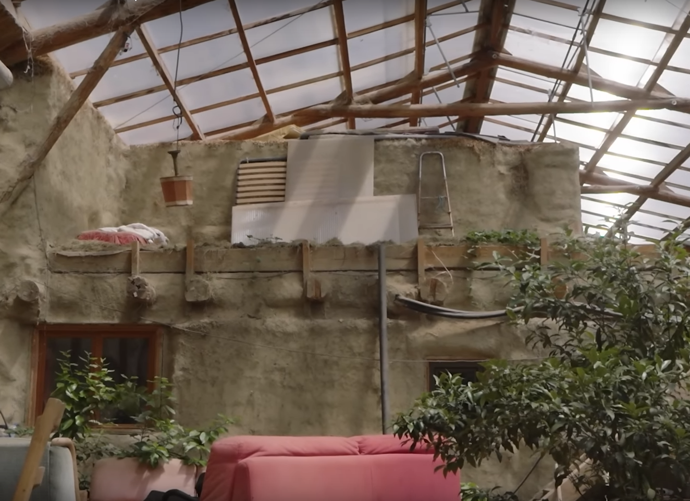

Serre
=====

Privilégier les serres en dur, ca tient beaucoup mieux dans le temps, contre les serres bâchées de plastique qui ont une durée de vie de ~10ans.

La serre Walipini est considérée comme étant une des plus efficaces.
Il s'agit d'une serre enterrée qui exploite l'inertie thermique du sol.
C'est également une excellente protection contre le gel.

Mettre la maison sous la serre permet de chauffer la serre grâce aux déperditions thermiques de la maison.
Attention cependant, il faut que la maison soit particulièrement bien isolée et ait une bonne innertie thermique à l'interrieur, afin qu'il ne fasse pas trop chaud dedans. Voir :ref:`isolation <Isolation>`.

