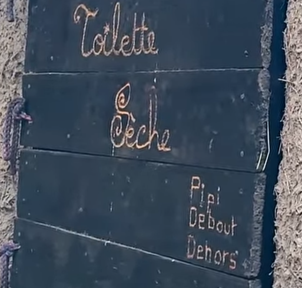
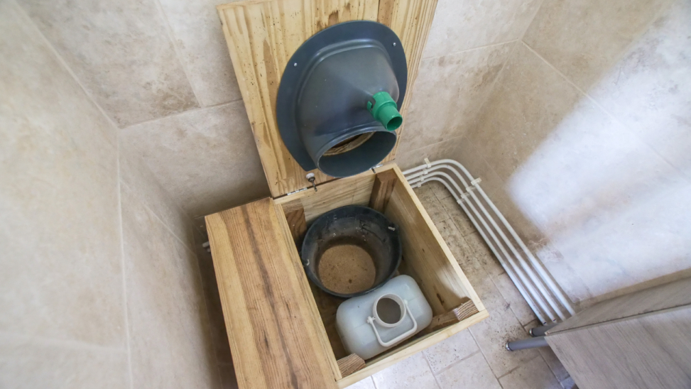
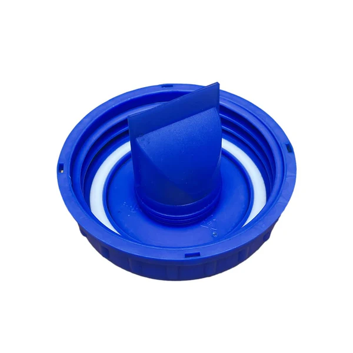

Toilette sèche
==============

La séparation ou non des fèces et urines détermine le type de technologie nécessaire pour leur valorisation.

La solution la plus simple consiste à ne pas séparer les fèces et l'urine (toilettes sèches en mélange à sciures) ; les selles et l'urine sont mélangées dans un récipient. Cette solution limite la valorisation des matières en simple compost pour le jardin.

La solution plus exigeante, mais beaucoup plus performante permettant une valorisation indépendante, consiste à séparer à la source les éléments ; les urines sont séparées des solides, fèces et papier toilette, dans leur réceptacle respectif pour être traitées séparément. 

Source: `Wikipedia <https://fr.wikipedia.org/wiki/Toilettes_s%C3%A8ches>`_

+------------------------------------+--------------------------------------------------------------------------------+-------------------------------------------------------------------------------------------------------------------------------------+
| **Type**                           | **Avantages**                                                                  | **Inconvénients**                                                                                                                   |
+------------------------------------+--------------------------------------------------------------------------------+-------------------------------------------------------------------------------------------------------------------------------------+
| Sans séparation, avec de la sciure | - Pas cher                                                                     | - S'approvisionner en sciure et la stocker                                                                                          |
|                                    | - Facile à fabriquer sois même                                                 | - S'assurer que la sciure ne proviennent pas de bois traités avec des traitements qui pourraient contaminer la terre via le compost |
|                                    | - Permet la création d'un humus riche pour le potager ou le jardin             | - Par an, prévoir un à deux mètres cubes de sciure pour un ménage de trois-quatre personnes                                         |
+------------------------------------+--------------------------------------------------------------------------------+-------------------------------------------------------------------------------------------------------------------------------------+
| Avec séparation                    | - Évite 80 % des odeurs                                                        | - Ne nécessite pas de sciure                                                                                                        |
|                                    | - Accélère la déshydratation des excréments                                    | - Un peu plus cher                                                                                                                  |
|                                    | - Possibilité de relier les urines au système d'eaux grises de la maison       | - Plus complexe à fabriquer soi-même                                                                                                |
|                                    | - Possibilité de directement arroser le jardin avec, en dilluant avec de l'eau |                                                                                                                                     |
|                                    | - Sciure facultative                                                           |                                                                                                                                     |
+------------------------------------+--------------------------------------------------------------------------------+-------------------------------------------------------------------------------------------------------------------------------------+
| Avec lombricompostage              | - Réduction de 30% du volume initial des excréments                            | - Traitement des `lixiviats <https://fr.wikipedia.org/wiki/Lixiviat>`_                                                              |
|                                    | - Production d'un compost très riche qui a la consistance d'un terreau         | - Nécessite la séparation des urines et des matières fécales                                                                        |
|                                    | - Absence de mauvaises odeurs                                                  | - Attendre de 3 à 6 mois avant attaque des matières par les lombrics                                                                |
|                                    |                                                                                | - Les lombrics doivent être maintenus dans des conditions de température et d'hygrométrie                                           |
+------------------------------------+--------------------------------------------------------------------------------+-------------------------------------------------------------------------------------------------------------------------------------+

Il existe des toilettes sèches avec un mécanisme de séparation de l'urine (pour arroser le jardin en dilluant dans de l'eau) et des excréments (pour le compost).

Pour éviter d'avoir des odeurs d'urine, il existe des couvercles de bidon à membrane qui s'ouvrent et se ferment tout seul (sans électricité) avec le passage de l'urine.

